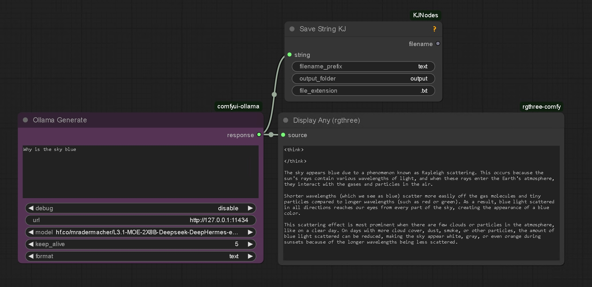
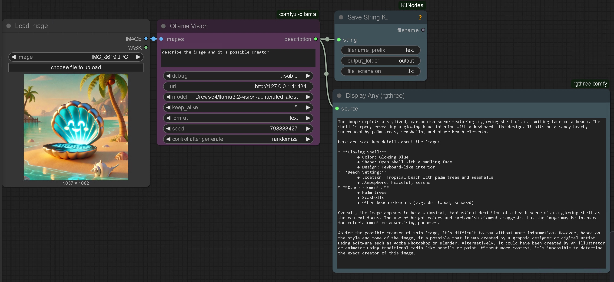
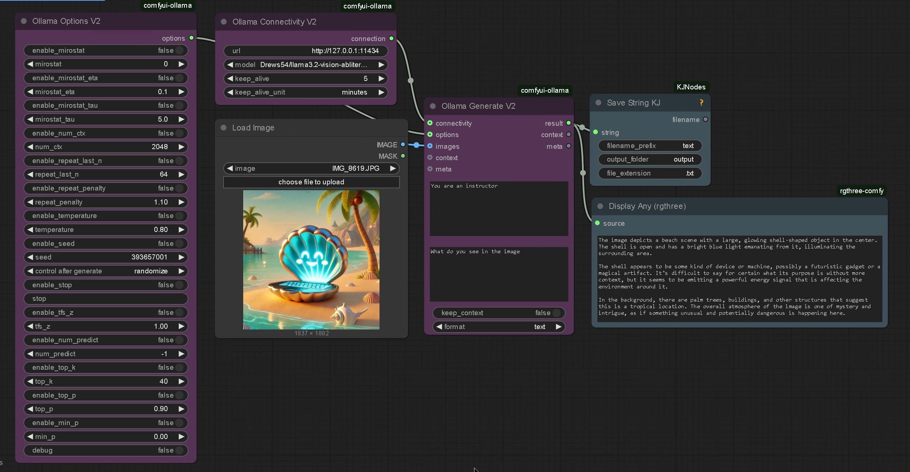

[](https://hub.docker.com/r/ls250824/run-comfyui-ollama)

# Run ComfyUI Ollama with Custom nodes on [RunPod.io](https://runpod.io?ref=se4tkc5o)

## Synopsis

A streamlined setup for running **ComfyUI** with **Ollama**.  
This pod downloads models as specified in the **environment variables** set in the [RunPod.io template](https://runpod.io/console/deploy?template=hx0q4csn2c&ref=se4tkc5o).  

- Models are automatically downloaded based on the specified paths in the environment configuration.  
- Authentication credentials can be set via secrets for:  
  - **Code server** authentication (not possible to switch off) 
  - **Hugging Face** tokens for model access.  

Ensure that the required environment variables and secrets are correctly set before running the pod.
See below for options.

## Hardware Requirements  
 
- **Recommended GPUs**: Nvidia RTX A4500, A40
- **Storage**:  
  - **Volume**: 20GB (`/workspace`)  
  - **Pod Volume**: 70Gb  

## Template [RunPod.io](https://runpod.io?ref=se4tkc5o)

- [template](https://runpod.io/console/deploy?template=hx0q4csn2c&ref=se4tkc5o)

## Available Images

### Base Images 

#### ls250824/pytorch-cuda-ubuntu-runtime
	
[](https://hub.docker.com/r/ls250824/pytorch-cuda-ubuntu-runtime)

#### ls250824/comfyui-runtime

[](https://hub.docker.com/r/ls250824/comfyui-runtime)

### Custom Build: 

```bash
docker pull ls250824/run-comfyui-ollama:<version>
```

## Environment Variables  

### **ComfyUI Arguments**  

| Token        | Environment Variable     |
|--------------|--------------------------|
| Arguments    | `COMFYUI_EXTRA_ARGUMENTS`|

### **Authentication Tokens**  

| Token        | Environment Variable |
|--------------|----------------------|
| Huggingface  | `HF_TOKEN`           |
| Code Server  | `PASSWORD`           |

### **Diffusion Lora Setup Huggingface**  

| Model Type        | URL (Huggingface or Ollama) |
|-------------------|-----------------------------|
| Ollama model      | `OLLAMA_MODEL[1-6]`         |

## Connection options 

### Services

| Service         | Port          |
|-----------------|---------------| 
| **ComfyUI**     | `8188` (HTTP) |
| **Code Server** | `9000` (HTTP) |
| **SSH/SCP**     | `22`   (TCP)  |
| **Gradio**      | `7860` (HTTP) |

## Website models

- [Huggingface](https://huggingface.co/)

## Websites software Github

- [ComfyUI](https://github.com/comfyanonymous/ComfyUI)
- [Code server](https://github.com/coder/code-server)
- [Ollama](https://github.com/ollama/ollama)

## Website custom_nodes

- [rgthree](https://github.com/rgthree/rgthree-comfy)
- [login](https://github.com/liusida/ComfyUI-Login)
- [manager](https://github.com/ltdrdata/ComfyUI-Manager)
- [KJNodes](https://github.com/kijai/ComfyUI-KJNodes)
- [Python](https://github.com/pydn/ComfyUI-to-Python-Extension)
- [Ollama](https://github.com/stavsap/comfyui-ollama)
- [Ollama Describer](https://github.com/alisson-anjos/ComfyUI-Ollama-Describer)

## Manual provisioning

[provisioning](provisioning/provisioning.md)

## Templates available in ComfyUI (left folder icon)







## Gradio

[Gradio chat in python source](gradio/chat_UnSlopNemo.py)

```bash
python gradio/chat_UnslopNemo.py
```

Interface available on exposed http port 7860

## Building the Docker Image 

This is not possible on [runpod.io](https://runpod.io?ref=se4tkc5o) use local hardware.
You can build and push the image to Docker Hub using the `build-docker.py` script.

### `build-docker.py` script options

| Option         | Description                                         | Default                |
|----------------|-----------------------------------------------------|------------------------|
| `--username`   | Docker Hub username                                 | Current user           |
| `--tag`        | Tag to use for the image                            | Today's date           |
| `--latest`     | If specified, also tags and pushes as `latest`      | Not enabled by default |

### Build & push Command

Run the following command to clone the repository and build the image:

```bash
git clone https://github.com/jalberty2018/run-comfyui-ollama.git
cp run-comfyui-ollama/build-docker.py ..

python3 build-docker.py \
--username=<your_dockerhub_username> \
--tag=<custom_tag> \ 
run-comfyui-ollama
```

Note: If you want to push the image with the latest tag, add the --latest flag at the end.


